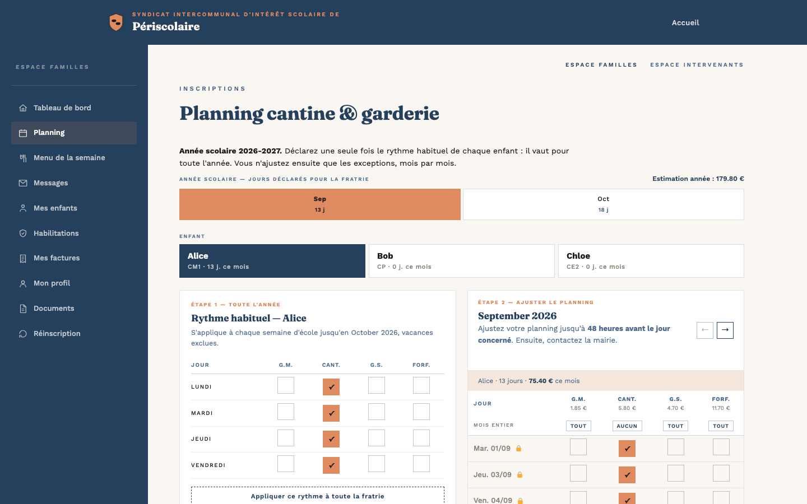
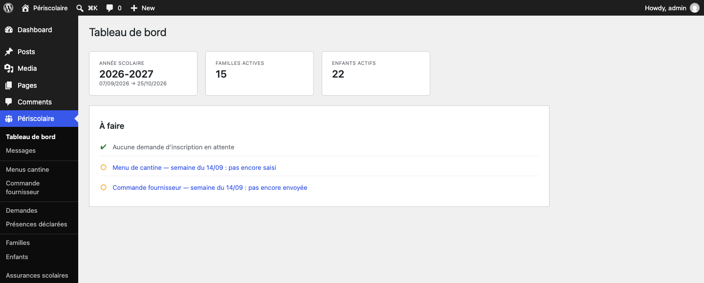
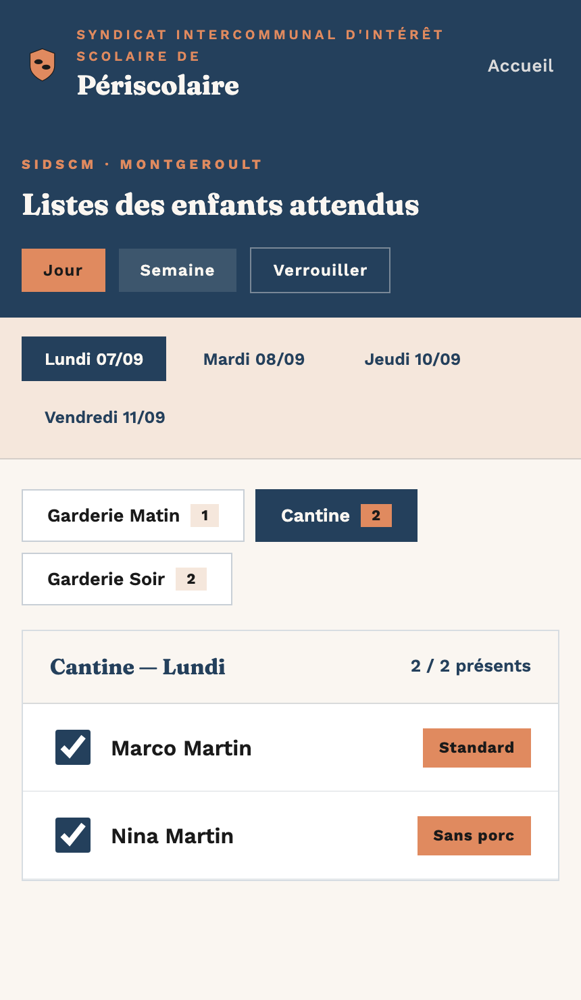

# Périscolaire — inscriptions, planning et facturation dans WordPress

**Le périscolaire, sans tableaux à recroiser.**

Périscolaire centralise les inscriptions, le planning annuel, la cantine, les garderies, les présences et la facturation. Les familles gèrent leurs besoins en ligne ; la mairie, les intervenants et le fournisseur travaillent à partir des mêmes données.

[](readme.txt)


[](LICENSE)



## Un seul planning, cinq usages

La famille renseigne une fois le rythme habituel de chaque enfant, puis seulement les exceptions. Ce planning alimente ensuite :

- les listes d’enfants attendus ;
- le pointage des présences ;
- les commandes de repas et de goûters ;
- les exports du secrétariat ;
- les factures mensuelles.

Moins de fichiers à maintenir, moins de doubles saisies et une information cohérente du portail famille jusqu’à la facturation.

## Pensé pour chaque utilisateur

### Pour les familles

- Première inscription guidée en quatre étapes.
- Connexion par lien reçu par e-mail, sans compte WordPress ni mot de passe à retenir.
- Planning annuel par enfant, rythme récurrent et ajustements mois par mois.
- Estimation des montants pour le mois et l’année.
- Dépôt de l’assurance scolaire et suivi de sa validation.
- Menus, messages de la mairie, factures PDF, profil et documents au même endroit.
- Gestion du second parent et des personnes autorisées à récupérer les enfants.
- Réinscription annuelle simplifiée pendant la campagne municipale.

Le menu de la cantine peut aussi être publié sur la page d’accueil du service et consulté sans connexion.

### Pour la mairie

- Tableau de bord avec les actions à traiter.
- Validation des demandes, des familles, des enfants et des assurances.
- Années scolaires, vacances, jours fériés, fermetures et délai de modification configurables.
- Menus de cantine et commandes fournisseur calculées depuis le planning.
- Messages ciblés ou programmés, avec suivi de la première consultation.
- Factures PDF, état des comptes et exports CSV ou ODS.
- Préparation des prélèvements SEPA au format bancaire `pain.008`.
- Passage d’année, proposition des nouvelles classes et campagne de réinscription.



### Pour les intervenants

Un écran dédié, protégé par code et adapté au mobile, affiche les enfants attendus en garderie ou à la cantine. Les agents peuvent :

- pointer les présents et les absents ;
- renseigner les heures d’arrivée et de départ ;
- consulter les régimes, allergies et repas apportés ;
- vérifier les personnes autorisées à récupérer un enfant ;
- consulter la semaine courante et les huit suivantes.

<p align="center">
  
</p>

## Comment se déroule une année ?

1. **La mairie prépare le service** : année scolaire, calendrier, tarifs, documents et règles de validation.
2. **La famille s’inscrit** : elle confirme son adresse e-mail, puis la mairie accepte ou refuse sa demande.
3. **Chaque enfant complète son dossier** : l’assurance est déposée dans le portail, puis validée automatiquement ou par la mairie selon le réglage choisi.
4. **La famille construit son planning** : un rythme pour l’année, puis des exceptions en cas d’imprévu. Chaque modification est enregistrée immédiatement.
5. **La mairie exploite les mêmes données** : listes terrain, commande fournisseur, factures, exports et prélèvements.

Le service couvre aussi les fratries, les régimes alimentaires, les allergies, le « midi sans repas », les fermetures ponctuelles et les corrections faites par la mairie.

## Installation rapide

### Prérequis

- WordPress 5.8 ou plus récent ;
- PHP 7.4 ou plus récent ;
- HTTPS et un transport d’e-mails fiable en production ;
- `ZipArchive` pour les exports ODS ;
- DOM/libxml pour l’export bancaire `pain.008`.

### Mise en route

1. Télécharger une archive depuis les [versions publiées](https://github.com/eflye/wp-plugin-extrascolaire/releases), puis placer le plugin dans `wp-content/plugins/periscolaire-registration/`.
2. Activer **Périscolaire — Inscriptions** dans WordPress.
3. Créer et activer l’année dans **Périscolaire > Années scolaires**, puis vérifier vacances, jours fériés, fermetures et préavis.
4. Compléter les tarifs, coordonnées, e-mails, documents et informations SEPA dans **Périscolaire > Réglages**.
5. Créer une page WordPress contenant le shortcode `[periscolaire_form]` et communiquer son URL aux familles.
6. Pour l’espace terrain, créer une seconde page avec `[periscolaire_sidscm]`, la sélectionner dans les réglages et définir son code d’accès.
7. Tester la réception des e-mails et la protection des documents avant d’ouvrir le service.

## Confidentialité et sécurité

Le plugin conserve les données sur le site WordPress de la collectivité. Il comprend notamment :

- des liens de connexion temporaires dont les jetons sont stockés sous forme hachée ;
- des sessions révocables et des contrôles d’accès côté serveur ;
- le chiffrement des IBAN au repos avec libsodium ou OpenSSL ;
- le stockage des assurances et factures hors de la médiathèque publique ;
- la limitation des tentatives sur les formulaires publics ;
- des protections WordPress contre les requêtes non autorisées et les injections.

Ces mécanismes techniques ne remplacent pas le travail de la collectivité sur l’hébergement, l’information des familles, les durées de conservation et son registre de traitements.

## À savoir avant de l’adopter

Ce projet a été conçu pour le service de **Montgeroult–Courcelles**. Son fonctionnement actuel suit la semaine scolaire du lundi, mardi, jeudi et vendredi, importe le calendrier de la zone C et conserve encore quelques libellés propres au SIDSCM. Une adaptation est donc à prévoir pour un autre territoire ou une autre organisation scolaire.

Le plugin ne propose pas de paiement en ligne. Il génère les factures et prépare les fichiers de prélèvement, mais ne transmet aucun ordre à la banque. L’acceptation du règlement se fait par case à cocher horodatée ; ce n’est pas une signature électronique qualifiée.

## Documentation

- [Historique des versions](readme.txt)
- [Export des ordres de prélèvement SEPA](docs/export-pain008.md)
- [Exemple d’auto-hébergement avec Docker](docs/self-hosting-docker.md)
- [Inventaire du schéma de données](docs/schema-inventory-2026-09-10.md)
- [Filet de sécurité du refactoring](docs/refactoring-safety-net.md)

<details>
<summary>Développer et tester localement</summary>

L’environnement de développement utilise WordPress, MySQL 8 et Mailpit avec Podman.

```bash
podman machine start
MAILPIT_ENABLED=true podman compose --profile mailpit up -d
npm ci
composer install
```

Vérifications principales :

```bash
npm run lint:js
composer phpstan
podman exec plugin-extrascolaire-wordpress-1 php /var/www/html/wp-content/plugins/periscolaire-registration/tests/unit/run.php
PSC_CONTAINER_ENGINE=podman PSC_WP_CONTAINER=plugin-extrascolaire-wordpress-1 npm run test:e2e
```

Les tests de bout en bout modifient la base locale : utilisez une instance de développement.

</details>

## Licence

Périscolaire est distribué sous licence [GNU General Public License v2 ou ultérieure](LICENSE).
