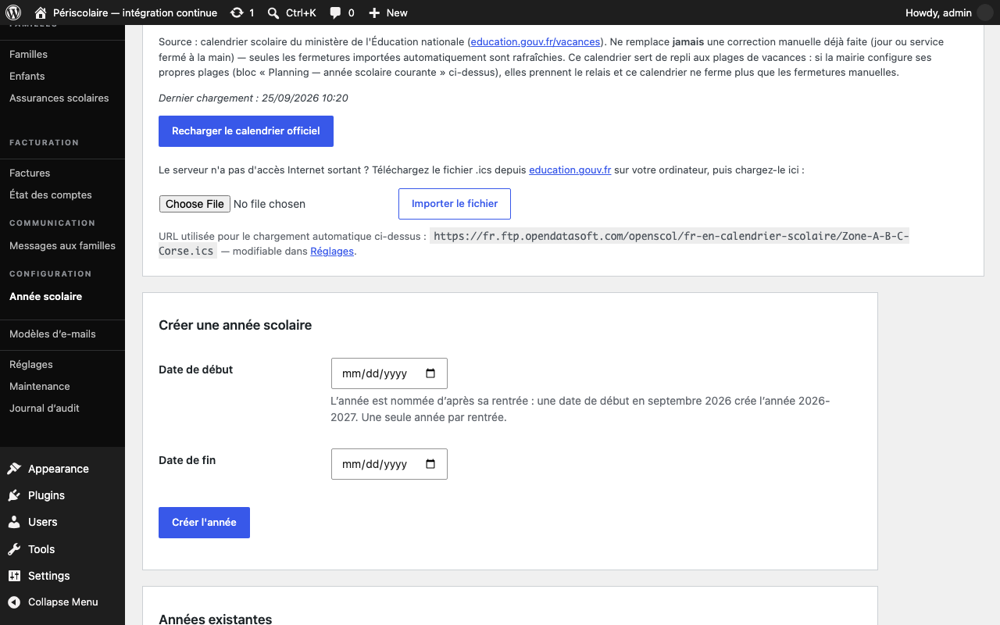
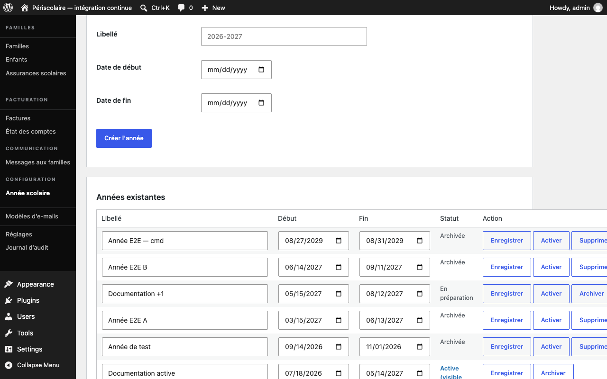

# Année scolaire

## Objectif

Créez et configurez l'[année scolaire](../glossaire.md#annee-scolaire) qui porte le calendrier et les inscriptions visibles par les familles.

## Avant de commencer

Connectez-vous avec un rôle autorisé à gérer le périscolaire. Préparez les dates de rentrée et de fin d'année, les périodes de vacances et les jours fériés à exclure.

## Étapes

1. Ouvrez **Périscolaire › Année scolaire**, puis repérez le formulaire **Créer une année scolaire**.
2. Renseignez **Date de début** et **Date de fin**, puis cliquez sur **Créer l'année**. La date de fin doit être postérieure à la date de début.

   L'année est nommée d'après sa rentrée : une date de début en septembre 2026 crée l'année **2026-2027**. Il n'existe qu'une année par rentrée ; pour changer les dates d'une année déjà créée, corrigez-la plutôt que d'en créer une seconde.

   

3. Dans **Années existantes**, contrôlez la ligne créée. Cliquez sur **Activer** pour la rendre visible aux familles. Une seule année peut être active à la fois : l'activation archive l'ancienne année et active la nouvelle en une seule opération. Une panne ne peut donc pas laisser le site sans année active, et cliquer de nouveau sur **Activer** ne change rien.

   

4. Pour retirer une année du fonctionnement courant tout en la conservant en lecture seule, cliquez sur **Archiver** et confirmez.
5. Pour corriger une année existante, modifiez sa **Date de début** ou sa **Date de fin** directement dans **Années existantes**, puis cliquez sur **Enregistrer**. Le nom de l'année suit sa date de début.
6. Pour supprimer une année qui n'est pas active, cliquez sur **Supprimer** et confirmez.

   !!! warning
       La suppression est définitive : les inscriptions des enfants pour cette année, leur classe et leur justificatif d'assurance sont supprimés. Activez d'abord une autre année si l'année ciblée est encore active.

7. Dans **Planning — année scolaire courante**, vérifiez les dates (ce sont celles de l'année : les modifier ici ou dans **Années existantes** revient au même), renseignez le **Préavis de modification** en heures et complétez les **Plages de vacances**, puis cliquez sur **Enregistrer la configuration du planning**. Contrôlez aussi les **Jours fériés à exclure** ; retirez un jour uniquement s'il doit redevenir un jour d'école.

## Résultat attendu

Une seule année est active, ses dates sont correctes et son planning exclut les vacances et jours fériés prévus. Les familles voient cette année et peuvent y déclarer leurs réservations.

## Pour aller plus loin

- [Calendrier et vacances](calendrier-vacances.md)
- [Passage de classe](../cycle-annuel/passage-de-classe.md)
- [Démarrage rapide](../demarrage-rapide.md)
