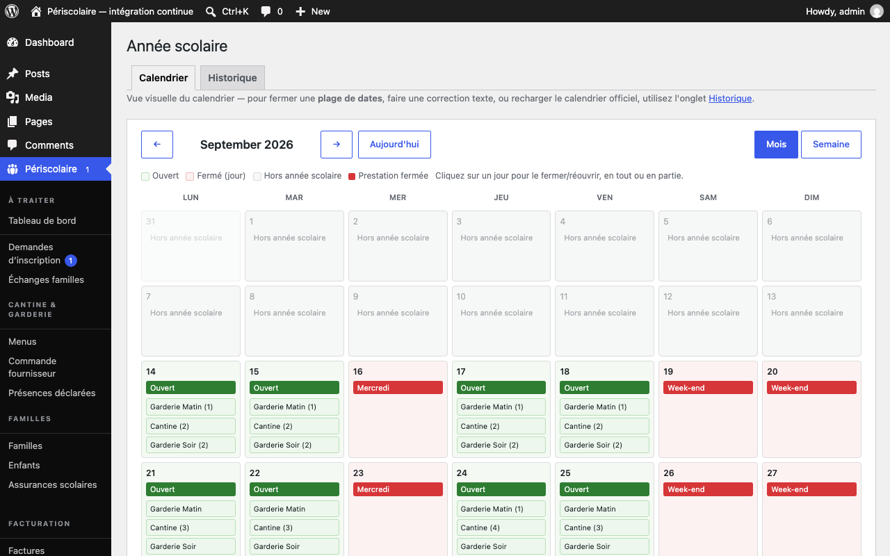
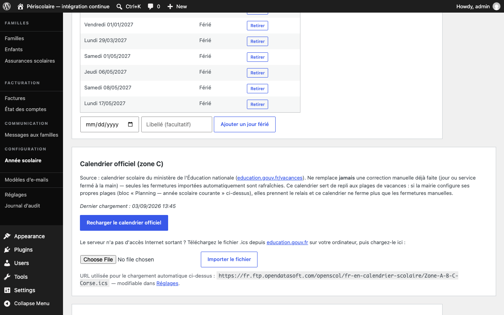

# Calendrier et vacances

## Objectif

Consultez les jours ouverts et fermés, importez le calendrier officiel de la zone C et corrigez les fermetures propres à votre commune.

## Avant de commencer

Ouvrez **Périscolaire › Année scolaire** avec un rôle de gestion. Activez et configurez l'année scolaire avant d'importer le calendrier ; vérifiez que le serveur peut accéder à Internet ou préparez un fichier `.ics` téléchargé depuis le ministère.

## Étapes

1. Sélectionnez l'onglet **Calendrier** pour afficher la vue **Mois** ou **Semaine**. Utilisez les flèches et les boutons **Aujourd'hui** ou **Cette semaine** pour vous déplacer dans le temps.
2. Lisez la légende en toutes lettres : **Ouvert** signifie que le jour accepte des prestations ; **Fermé (jour)** indique une fermeture complète ; **Prestation fermée** indique qu'un seul service est indisponible ; **Hors année scolaire** signifie que la date ne relève d'aucune année configurée. Cliquez sur un jour ouvert pour fermer ou rouvrir tout ou partie de ses prestations.

   

3. Passez à l'onglet **Historique**, puis repérez **Calendrier officiel (zone C)**. Cliquez sur **Charger le calendrier officiel** pour récupérer les vacances du ministère de l'Éducation nationale. Un rechargement actualise uniquement les fermetures importées ; il ne remplace jamais une correction manuelle.

   

4. Si le serveur n'a pas d'accès Internet sortant, téléchargez le fichier `.ics` depuis le lien du ministère sur votre ordinateur, sélectionnez-le dans le formulaire, puis cliquez sur **Importer le fichier**. Les mêmes règles de conservation des corrections manuelles s'appliquent.
5. Pour fermer exceptionnellement un jour ou une période, restez dans **Historique** et utilisez **Corriger un jour manuellement**. Renseignez **Fermer du**, laissez **Au (optionnel)** vide pour un seul jour ou indiquez une date de fin, ajoutez un **Motif**, puis cliquez sur **Fermer**.

   !!! warning
       Si des inscriptions existent sur la période, la fermeture les supprimera et les familles concernées recevront un e-mail. Vérifiez la liste proposée dans **Confirmation nécessaire** avant de cliquer sur **Confirmer la fermeture**.

6. Pour annuler une fermeture ponctuelle, renseignez la date dans **Réouvrir le**, puis cliquez sur **Réouvrir ce jour**. Le jour redevient ouvert, sauf s'il est exclu par les vacances ou les jours fériés de l'année scolaire.

## Résultat attendu

Le calendrier affiche des états compréhensibles pour chaque date, les vacances officielles sont importées et vos fermetures locales sont conservées sans supprimer une inscription par inadvertance.

## Pour aller plus loin

- [Année scolaire](annee-scolaire.md)
- [Services et tarifs](services-tarifs.md)
- [Démarrage rapide](../demarrage-rapide.md)
