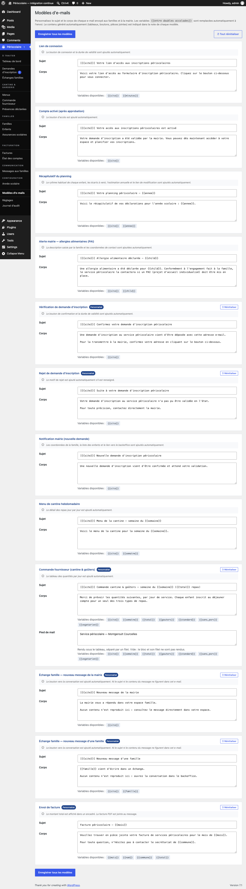

# Modèles d'e-mails

## Objectif

Personnalisez les sujets et les textes des e-mails envoyés automatiquement aux familles et à la mairie.

## Avant de commencer

Connectez-vous à WordPress avec un rôle autorisé à gérer les réglages. Les tableaux, boutons, pièces jointes et liens sont ajoutés automatiquement : vous modifiez uniquement le sujet, le corps et, pour la commande fournisseur, le pied de mail.

## Étapes

1. Ouvrez **Périscolaire › Modèles d'e-mails**. Chaque carte correspond à un modèle réellement utilisé par le plugin.
2. Modifiez le **Sujet** et le **Corps** du modèle choisi. Conservez les variables entre doubles accolades : elles sont remplacées au moment de l'envoi.
3. Utilisez les variables disponibles pour chaque modèle :

   | Modèle | Variables |
   | --- | --- |
   | **Lien de connexion** | `{{site}}`, `{{minutes}}` |
   | **Compte activé (après approbation)** | `{{site}}` |
   | **Récapitulatif du planning** | `{{site}}`, `{{annee}}` |
   | **Alerte mairie — allergies alimentaires (PAI)** | `{{site}}`, `{{child}}` |
   | **Vérification de demande d'inscription** | `{{site}}` |
   | **Rejet de demande d'inscription** | `{{site}}` |
   | **Notification mairie (nouvelle demande)** | `{{site}}` |
   | **Menu de cantine hebdomadaire** | `{{site}}`, `{{semaine}}` |
   | **Commande fournisseur (cantine & goûters)** | `{{site}}`, `{{semaine}}`, `{{total}}`, `{{gouters}}`, `{{standard}}`, `{{sans_porc}}`, `{{vegetarien}}` |
   | **Échange famille — nouveau message de la mairie** | `{{site}}` |
   | **Échange famille — nouveau message d’une famille** | `{{site}}`, `{{famille}}` |
   | **Envoi de facture** | `{{mois}}`, `{{nom}}`, `{{commune}}`, `{{total}}` |

   

4. Pour le modèle **Commande fournisseur (cantine & goûters)**, renseignez aussi le **Pied de mail** si vous souhaitez afficher une signature sous le tableau des quantités. Laissez-le vide pour supprimer ce bloc.
5. Cliquez sur **Enregistrer tous les modèles** en haut ou en bas de la page. Les changements sont appliqués aux prochains e-mails.
6. Pour revenir au texte par défaut, cliquez sur **Réinitialiser** sur une carte personnalisée. Pour tout restaurer en une fois, cliquez sur **Tout réinitialiser** et confirmez.

## Résultat attendu

Les prochains e-mails reprennent vos sujets et textes, avec les informations dynamiques remplacées automatiquement et les éléments techniques ajoutés au bon endroit.

## Pour aller plus loin

- [Services et tarifs](services-tarifs.md)
- [Tableau de bord](../gestion-quotidienne/tableau-de-bord.md)
- [Démarrage rapide](../demarrage-rapide.md)
