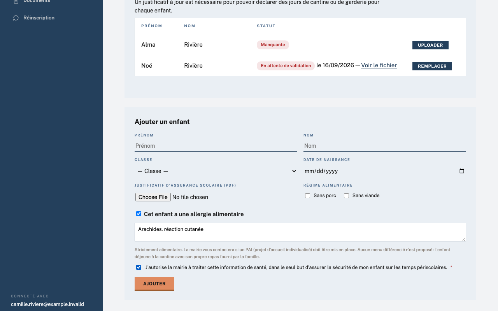

# Régimes alimentaires

## Objectif

Cette page explique les informations alimentaires saisies sur la fiche d'un enfant ; il n'existe pas d'écran de réglages global pour les régimes.

## Avant de commencer

Pour une modification côté famille, connectez-vous au portail avec le lien reçu par e-mail. Pour une correction côté mairie, ouvrez **Périscolaire › Enfants** avec un rôle de gestion et vérifiez l'information auprès du responsable.

## Étapes

1. Lors d'une inscription ou de l'ajout d'un enfant dans le portail, repérez **Régime alimentaire** et cochez **Sans porc** ou **Sans viande** selon les informations communiquées par la famille.
2. Pour déclarer une allergie, cochez **Cet enfant a une allergie alimentaire**. Décrivez ensuite les aliments à exclure, la réaction en cas d'ingestion et la conduite à tenir dans le champ d'allergie alimentaire.
3. Cochez la case de consentement distincte autorisant la mairie à traiter cette information de santé pour la sécurité de l'enfant. Le consentement est horodaté ; il est redemandé si la description de l'allergie est nouvelle ou modifiée.

   

4. Enregistrez la fiche. La famille peut renseigner ou corriger ces champs depuis son inscription ou son portail ; la mairie peut également les mettre à jour depuis **Enfants**. Une déclaration d'allergie nouvelle ou modifiée prévient le service périscolaire.

   !!! tip
       L'allergie reste strictement alimentaire : aucun menu différencié n'est proposé. La famille fournit le repas adapté de l'enfant lorsque celui-ci déjeune à la cantine.

## Résultat attendu

Chaque fiche enfant indique les régimes utiles à la préparation des repas, et toute allergie comporte une description exploitable ainsi qu'un consentement distinct enregistré.

## Pour aller plus loin

- [Services et tarifs](services-tarifs.md)
- [Documents (assurance)](../gestion-quotidienne/documents-assurance.md)
- [Année scolaire](annee-scolaire.md)
