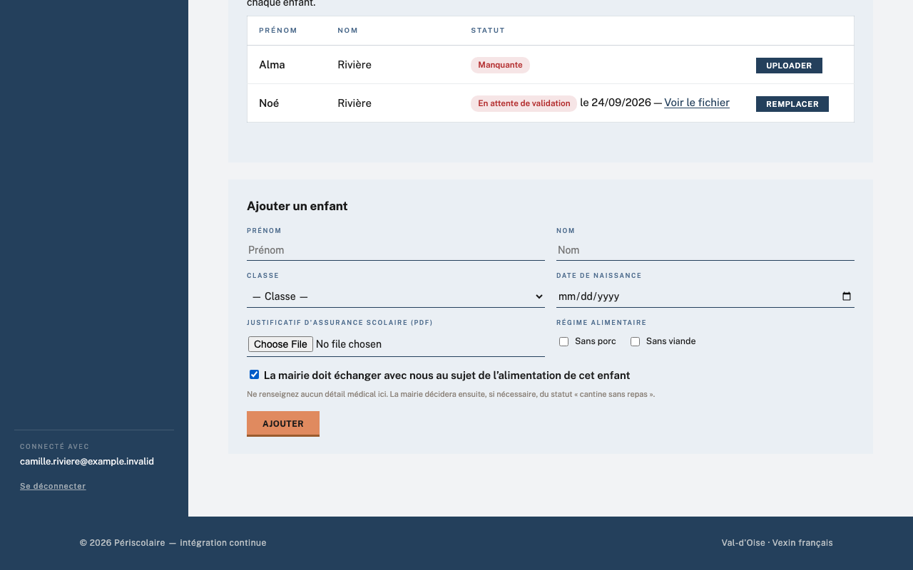

# Régimes alimentaires

## Objectif

Cette page explique les informations alimentaires portées par la fiche d'un enfant : les régimes utiles à la préparation des repas, et le signalement qui déclenche un échange avec la mairie. Il n'existe pas d'écran de réglages global pour les régimes.

## Avant de commencer

Pour une modification côté famille, connectez-vous au portail avec le lien reçu par e-mail. Pour une correction côté mairie, ouvrez **Périscolaire › Enfants** avec un rôle de gestion et vérifiez l'information auprès du responsable.

## Étapes

1. Lors d'une inscription ou de l'ajout d'un enfant dans le portail, repérez **Régime alimentaire** et cochez **Sans porc** ou **Sans viande** selon les informations communiquées par la famille.
2. Si l'alimentation de l'enfant demande une attention particulière, cochez **La mairie doit échanger avec nous au sujet de l'alimentation de cet enfant**. Ce parcours ne demande aucun détail médical : ni description, ni pièce jointe, ni case de consentement.

    !!! warning
        Ne reportez jamais un détail d'allergie dans un autre champ du formulaire (message, nom, régime). Le signalement existe précisément pour qu'aucune donnée de santé ne transite par un formulaire public ni par une notification.

    

3. À l'enregistrement, le service périscolaire reçoit l'e-mail **Échange à prévoir sur l'alimentation**. Il nomme l'enfant, la famille et la classe, sans aucune information de santé, et renvoie vers la fiche enfant du backoffice.
4. La mairie prend l'initiative du contact et recueille de vive voix ce qui est nécessaire. Aucun menu différencié n'est proposé : lorsque l'enfant déjeune à la cantine, la famille fournit son repas adapté.
5. À l'issue de l'échange, ouvrez **Périscolaire › Enfants**. Si nécessaire, sur la ligne de l'enfant, choisissez la date **À partir du** puis cliquez sur **Cantine sans repas**. Ce statut n'est jamais activé par la famille : il reste la décision de la mairie. Il se retire de la même façon, à une date choisie, avec **Rétablir les repas**. Les jours avant la date ne changent pas, qu'ils soient déjà facturés ou non. Un statut prévu pour plus tard s'annonce sous la ligne (« sans repas à partir du… »).

    Dans le planning de la famille, la cantine de cet enfant apparaît alors en **Midi sans repas** : ce qui s'affiche est ce qui sera facturé, et la famille peut cocher ou décocher ces jours comme d'habitude.

    !!! note
        Les descriptions d'allergie saisies avant cette évolution restent affichées en lecture seule sur la fiche enfant, pour ne pas perdre une information de sécurité déjà transmise. Elles ne sont plus modifiables depuis le portail, et leur durée de conservation relève de l'arbitrage du DPO.

## Résultat attendu

Chaque fiche enfant indique les régimes utiles à la préparation des repas. Les familles concernées sont repérées par un signalement sans contenu médical, l'échange a lieu de vive voix, et la décision de la mairie se lit à l'activation éventuelle de **Cantine sans repas**.

## Pour aller plus loin

- Côté famille : [Mes enfants et assurance](../familles/enfants.md) (guide des familles)
- [Services et tarifs](services-tarifs.md)
- [Documents (assurance)](../gestion-quotidienne/documents-assurance.md)
- [Année scolaire](annee-scolaire.md)
