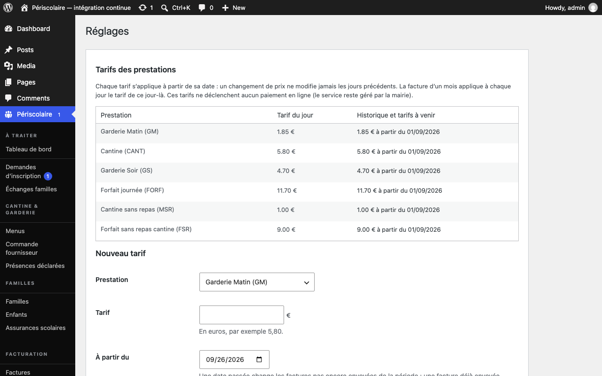

# Services et tarifs

## Objectif

Définissez le prix de chaque [service](../glossaire.md#service) et le délai qui verrouille les modifications du planning des familles.

## Avant de commencer

Connectez-vous avec un rôle autorisé à gérer les réglages. Décidez des montants facturés par la collectivité et du nombre d'heures de préavis nécessaire avant chaque jour de prestation.

## Étapes

1. Ouvrez **Périscolaire › Réglages**, puis repérez **Tarifs des prestations**. Les montants saisis sont affichés aux familles ; aucun paiement en ligne n'est déclenché par le plugin.
2. Renseignez le montant en euros pour chaque ligne : **Garderie Matin (GM)** (1,85 € par défaut), **Cantine (CANT)** (5,80 €), **Garderie Soir (GS)** (4,70 €), **Forfait journée (FORF)** (11,70 €), **Cantine sans repas (MSR)** (1,00 €) et **Forfait sans repas cantine (FSR)** (9,00 €). Le [forfait journée](../glossaire.md#forfait-journee) regroupe la garderie du matin, la cantine et la garderie du soir ; le forfait sans repas est une variante de facturation.

   

3. Repérez **Délai de modification**, puis renseignez **Préavis minimum** en heures. La valeur par défaut est de 48 heures ; mettez 0 pour désactiver le verrouillage général.
4. Enregistrez les réglages. Au-delà du délai avant le jour concerné, les familles ne peuvent plus modifier leur planning ni utiliser **Annulation / signalement d'absence**. La mairie peut toujours corriger une réservation depuis le backoffice.
5. Si nécessaire, ajustez aussi le préavis propre à l'année active depuis la page [Année scolaire](annee-scolaire.md) : ce réglage de planning s'applique alors à cette année.

## Résultat attendu

Les familles voient les tarifs à jour et ne peuvent plus modifier une réservation après le délai défini, tandis que la mairie conserve sa capacité de correction.

## Pour aller plus loin

- [Année scolaire](annee-scolaire.md)
- [Calendrier et vacances](calendrier-vacances.md)
- [Factures PDF](../facturation/factures-pdf.md)
