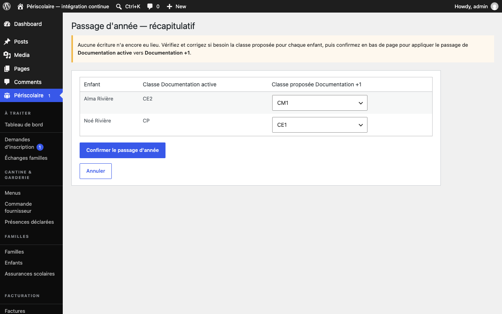

# Passage de classe

## Objectif

Faites progresser les enfants actifs vers l'année scolaire suivante après vérification de leur [classe](../glossaire.md#classe) proposée.

## Avant de commencer

Créez l'année cible et vérifiez que l'année de départ contient les inscriptions à traiter. Connectez-vous à WordPress avec un rôle autorisé à gérer les années scolaires.

## Étapes

1. Depuis **Périscolaire › Année scolaire**, ouvrez **Passage à l'année suivante**, choisissez **Depuis l'année** et **Vers l'année**, puis cliquez sur **Préparer le passage d'année**.
2. Examinez le récapitulatif : chaque enfant actif inscrit dans l'année de départ apparaît avec sa classe actuelle et la **Classe proposée** pour l'année cible. À ce stade, aucune écriture n'a encore eu lieu.

   

3. Corrigez ligne par ligne une proposition si nécessaire dans la liste **Classe proposée**. Choisissez **Sortie (fin de cycle périscolaire)** pour un enfant qui quitte le périscolaire ; aucune inscription ne sera créée pour lui dans l'année cible.
4. Cliquez sur **Confirmer le passage d'année** (bouton **Confirmer**) après votre contrôle.

   !!! warning
       La confirmation écrit réellement les nouvelles inscriptions et les sorties en base. Le récapitulatif seul ne modifie aucune donnée.

5. Pour adapter les propositions automatiques, ouvrez **Périscolaire › Réglages**, puis **Passage d'année : progression des classes**. Modifiez la classe suivante proposée pour chaque niveau ; la mairie pourra toujours corriger une ligne dans le récapitulatif.

## Résultat attendu

Les enfants promus disposent d'une inscription dans l'année cible avec la classe vérifiée, tandis que les enfants en fin de cycle sont sortis sans inscription nouvelle.

## Pour aller plus loin

- [Campagne de réinscription](reinscription.md)
- [Année scolaire](../configuration/annee-scolaire.md)
- [Démarrage rapide](../demarrage-rapide.md)
