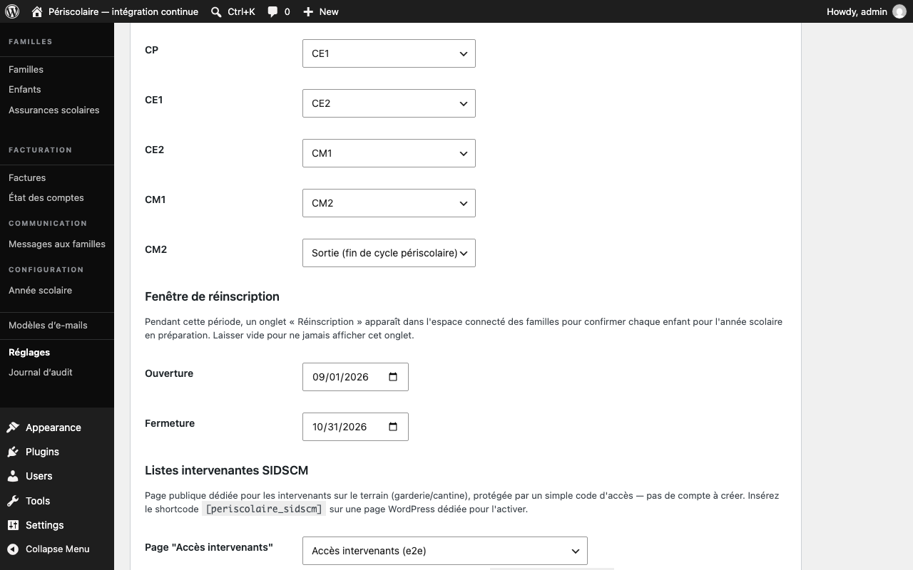

# Campagne de réinscription

## Objectif

Ouvrez une fenêtre pour que chaque famille confirme la réinscription de ses enfants dans la prochaine [année scolaire](../glossaire.md#annee-scolaire).

## Avant de commencer

Créez l'année cible avec le statut **En préparation** et vérifiez la correspondance des classes. Connectez-vous ensuite avec un rôle autorisé à gérer les réglages.

## Étapes

1. Ouvrez **Périscolaire › Réglages**, puis repérez **Fenêtre de réinscription**. Renseignez **Ouverture** et **Fermeture** ; laissez les deux champs vides pour ne jamais afficher l'onglet aux familles.
2. Enregistrez les réglages. Pendant la période comprise entre ces deux dates, l'onglet **Réinscription** apparaît dans l'espace connecté des familles.
3. La famille ouvre **Réinscription** et examine chaque enfant. Pour chaque enfant qui continue, elle coche **Réinscrire**, joint un **Nouveau justificatif d'assurance scolaire** et accepte le règlement intérieur pour l'année cible, puis clique sur **Confirmer la réinscription**.

   

4. Un enfant en fin de cycle est signalé **Fin de cycle périscolaire** et ne peut pas être réinscrit dans l'année cible. Aucune inscription n'est créée pour lui.
5. Si la famille décoche un enfant, celui-ci n'est pas réinscrit automatiquement pour l'année cible. La famille peut encore le confirmer tant que la fenêtre reste ouverte.
6. Si une famille ne fait rien, aucun enfant ne sort automatiquement du foyer : la mairie retrouve simplement l'absence de réinscription dans le suivi de l'année cible et prend contact si nécessaire.

## Résultat attendu

Les enfants confirmés disposent d'une inscription et d'un justificatif d'assurance pour l'année cible, les sorties de fin de cycle sont respectées et aucune famille inactive n'est supprimée automatiquement.

## Pour aller plus loin

- Côté famille : [Réinscription](../familles/reinscription.md) (guide des familles)
- [Passage de classe](passage-de-classe.md)
- [Année scolaire](../configuration/annee-scolaire.md)
- [Documents (assurance)](../gestion-quotidienne/documents-assurance.md)
