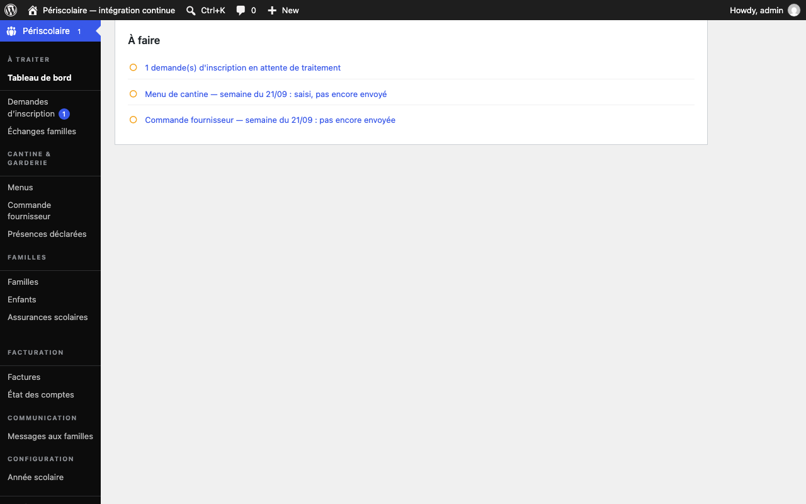

# Démarrage rapide

## Objectif

Mettez le service périscolaire en ordre de marche avant l'ouverture aux familles et contrôlez les actions urgentes depuis le tableau de bord.

## Avant de commencer

Connectez-vous à WordPress avec un rôle autorisé à gérer le périscolaire. Vérifiez que vous disposez des dates de l'année scolaire, du calendrier des vacances et des informations nécessaires aux menus et aux commandes fournisseur.

## Étapes

1. Ouvrez **Périscolaire › Tableau de bord** et consultez la rubrique **À faire**. Elle reprend les actions calculées à partir des données du service.

   

2. Traitez les demandes affichées comme **demande(s) d'inscription en attente de traitement** depuis **Périscolaire › Demandes**. Approuvez ou refusez chaque demande après vérification des informations transmises.

3. Préparez le menu de cantine de la prochaine semaine ouverte lorsqu'il est indiqué **Menu de cantine — semaine du … : pas encore saisi** ou **saisi, pas encore envoyé**. Ouvrez **Périscolaire › Menus** pour le compléter, puis envoyez-le.

4. Préparez la commande fournisseur lorsque **Commande fournisseur — semaine du … : pas encore envoyée** apparaît. Ouvrez **Périscolaire › Commandes fournisseur**, contrôlez les quantités et envoyez la commande.

5. Si **Aucune année scolaire configurée — définissez dates, vacances et fériés pour ouvrir le planning** apparaît, créez et configurez l'année scolaire. Si **L'année scolaire se termine dans … jour(s) — préparez la suivante** (ou **L'année scolaire est terminée — configurez la suivante**) apparaît, préparez la prochaine année avant la rentrée.

   

6. Poursuivez avec [Configuration](configuration/annee-scolaire.md) pour la première mise en service, puis utilisez [Gestion au quotidien](gestion-quotidienne/tableau-de-bord.md) pour le suivi courant. Ces pages détaillent chaque écran sans reprendre cette check-list.

## Résultat attendu

La rubrique **À faire** ne contient plus d'action urgente non traitée, ou vous avez identifié l'action restante et son responsable avant l'ouverture du service.

## Pour aller plus loin

- [Année scolaire](configuration/annee-scolaire.md)
- [Tableau de bord](gestion-quotidienne/tableau-de-bord.md)
- [Glossaire](glossaire.md)
