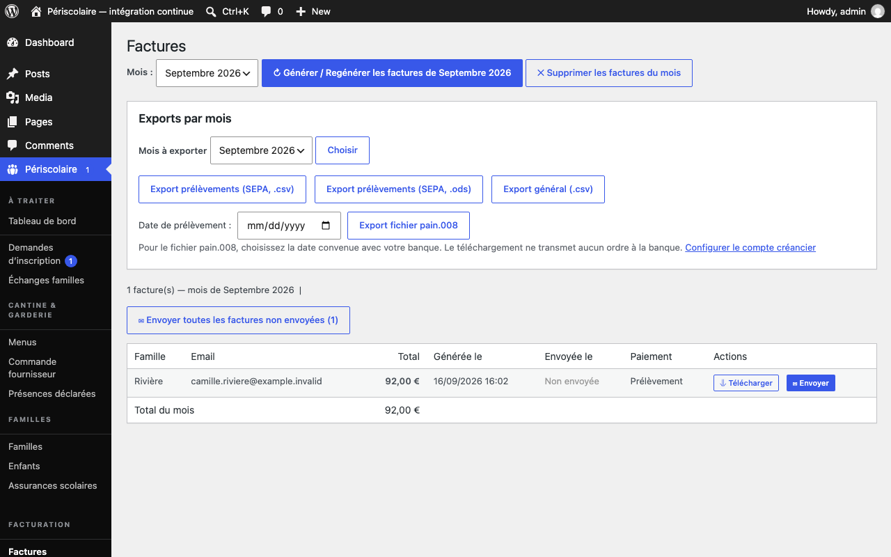

# Mandats SEPA

## Objectif

Gérez l'autorisation de prélèvement de chaque foyer et produisez le fichier mensuel à remettre à la banque.

## Avant de commencer

Connectez-vous avec un rôle autorisé à gérer la facturation. Demandez à la collectivité son identité créancier, son IBAN, son BIC et son identifiant ICS, ainsi que la date de prélèvement convenue avec la banque.

## Étapes

1. Côté famille, le responsable accepte le [mandat SEPA](../glossaire.md#mandat-sepa) lors de son inscription ou depuis **Mon profil**, renseigne ses coordonnées bancaires et télécharge le mandat généré. Cette étape est réalisée par la famille ; la mairie ne la saisit pas à sa place.
2. Dans **Périscolaire › Réglages**, renseignez une fois **Identifiant créancier SEPA (ICS)**, **IBAN du compte créancier** et, de préférence, **BIC de la banque du créancier**. L'IBAN de la collectivité est enregistré chiffré.
3. Dans **Périscolaire › Factures**, sélectionnez le mois et ouvrez **Exports par mois**. Vérifiez d'abord que les factures du mois ont été générées et que les familles en prélèvement disposent d'un mandat accepté.
4. Choisissez la **Date de prélèvement :** convenue avec votre banque, puis cliquez sur **Export fichier pain.008**.

   

5. Téléchargez le fichier et déposez-le vous-même dans l'espace bancaire de la collectivité. Conservez le suivi de la remise et des éventuels rejets dans l'outil de la banque.

   !!! tip
       Le téléchargement du fichier pain.008 ne transmet aucun ordre à la banque. Le plugin prépare le fichier ; vous restez responsable de son dépôt et de sa validation bancaire.

## Résultat attendu

Le fichier pain.008 contient uniquement les factures positives des foyers actifs disposant d'un mandat valide, avec la date de prélèvement choisie, sans modifier les factures ni leur statut d'envoi.

## Pour aller plus loin

- [Factures PDF](factures-pdf.md)
- [Services et tarifs](../configuration/services-tarifs.md)
- [Démarrage rapide](../demarrage-rapide.md)
