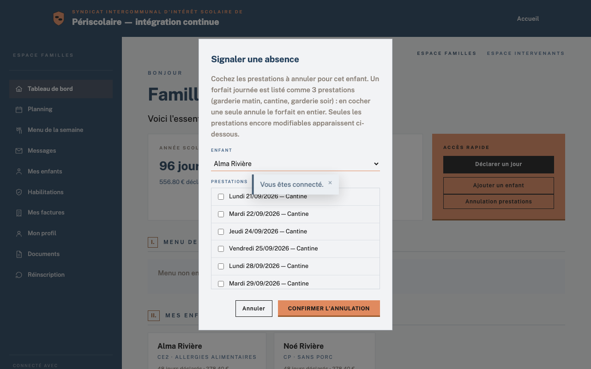

# Annulations et absences

## Objectif

Expliquez à la famille comment signaler une [absence](../glossaire.md#absence) et utilisez le même écran pour corriger une présence depuis la mairie.

## Avant de commencer

Pour un signalement familial, la famille doit être connectée à son portail et disposer d'une réservation à venir. Pour une correction mairie, connectez-vous à WordPress avec un rôle autorisé et ouvrez **Périscolaire › Présences déclarées**.

## Étapes

1. La famille ouvre **Annulation prestations** depuis son tableau de bord, choisit l'**Enfant**, puis coche les **Prestations** à retirer. Seules les prestations encore modifiables sont proposées.

   

2. La famille clique sur **Confirmer l'annulation**. Le signalement écrit une exception de retrait, la prestation n'est plus facturée et la mairie reçoit une notification.
3. Pour un **Forfait journée**, l'interface affiche les trois prestations (garderie matin, cantine et garderie soir) ; cocher l'une d'elles annule le forfait entier.
4. La famille ne peut plus annuler après le délai de modification défini pour le service. Consultez [Services et tarifs](../configuration/services-tarifs.md) pour la notion de préavis.
5. La mairie ouvre **Présences déclarées**, sélectionne l'enfant et le jour à corriger, puis modifie les prestations déclarées. Elle clique sur **Enregistrer et notifier la famille** pour enregistrer la correction et prévenir le foyer.
6. La mairie n'est jamais soumise au préavis : elle peut corriger une réservation même lorsque la famille ne voit plus le jour dans **Annulation prestations**.

## Résultat attendu

Les annulations valides sont retirées du planning et de la facturation, la famille est informée des corrections mairie et l'historique des présences reste cohérent.

## Pour aller plus loin

- Côté famille : [Tableau de bord](../familles/tableau-de-bord.md) (guide des familles)
- [Services et tarifs](../configuration/services-tarifs.md)
- [Tableau de bord](tableau-de-bord.md)
- [Menus de cantine](menus-cantine.md)
