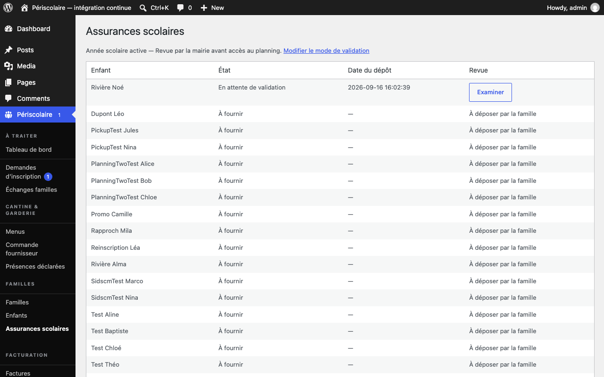

# Documents (assurance)

## Objectif

Suivez le dépôt et la validation du justificatif d'assurance scolaire de chaque enfant actif.

## Avant de commencer

Connectez-vous à WordPress avec un rôle autorisé à gérer les familles. Demandez à la famille un fichier lisible au format accepté avant de vérifier son dossier.

## Étapes

1. La famille dépose ou remplace le justificatif depuis **Mes enfants** dans son portail. Le document est conservé dans l'espace privé du plugin et rattaché à l'année scolaire active.

   Le fichier est vérifié sur son **contenu**, pas seulement sur son nom : ce doit être un vrai PDF, JPEG ou PNG, complet et de 1 Mo au plus. Un fichier renommé « .pdf », tronqué ou illisible est refusé avec le message « Format de fichier non accepté (PDF, JPG ou PNG uniquement) », tout comme un PDF qui contient du JavaScript ou des fichiers cachés. Un dépôt refusé ne remplace jamais le justificatif précédent. Si une attestation d'assureur est refusée à tort, demandez à la famille de la réenregistrer en PDF depuis son logiciel, ou de la photographier.

   Si l'enregistrement échoue à cause d'un incident sur le serveur (disque plein, base indisponible), rien n'est enregistré à moitié. Le justificatif précédent reste en place, et un enfant n'est jamais ajouté sans son justificatif. La famille voit un message d'erreur qui lui demande de réessayer. Lors d'une réinscription de plusieurs enfants, tous les fichiers sont contrôlés avant le premier enregistrement.

   !!! note "Justificatif déposé avec une demande d'inscription"
       Quand vous validez une demande, le justificatif joint est rattaché à l'enfant créé. Si ce rattachement échoue, la demande est quand même validée, le fichier reste conservé, et le plugin retente le rattachement une fois par jour. Il ne remplace jamais un justificatif que la famille aurait déposé entre-temps. Chaque échec puis chaque reprise est noté dans le **Journal d'audit** (« assurance.promotion_echec », puis « assurance.promotion_reprise »). Si l'échec persiste, demandez à la famille de déposer le justificatif depuis **Mes enfants**.
2. Ouvrez **Périscolaire › Assurances scolaires**. Le tableau liste chaque enfant actif, l'état du document, la date du dépôt et l'action de revue.

   

3. Dans **Réglages**, choisissez le mode adapté à votre organisation : **Acceptation automatique après dépôt** valide immédiatement un fichier transmis ; **Revue par la mairie avant accès au planning** vous laisse examiner chaque document avant d'autoriser le planning.
4. En mode manuel, cliquez sur **Examiner** pour l'enfant concerné, puis sur **Ouvrir le document dans un nouvel onglet**. Ajoutez un **Message à la famille** si le document doit être remplacé.
5. Cliquez sur **Valider l’assurance** si le justificatif est conforme. S'il ne l'est pas, cliquez sur **Refuser — demander un remplacement** et indiquez obligatoirement le motif à transmettre à la famille.
6. Contrôlez ensuite l'état affiché dans la liste. Un justificatif manquant ou refusé bloque le planning pour l'enfant concerné jusqu'à la réception et l'acceptation d'un nouveau document.

## Résultat attendu

Chaque enfant actif possède un justificatif identifiable et accepté pour l'année en cours, ou la famille sait précisément quel document remplacer avant de pouvoir déclarer son planning.

## Pour aller plus loin

- Côté famille : [Mes enfants et assurance](../familles/enfants.md) (guide des familles)
- [Modération des inscriptions](moderation-inscriptions.md)
- [Régimes alimentaires](../configuration/regimes-alimentaires.md)
- [Année scolaire](../configuration/annee-scolaire.md)
