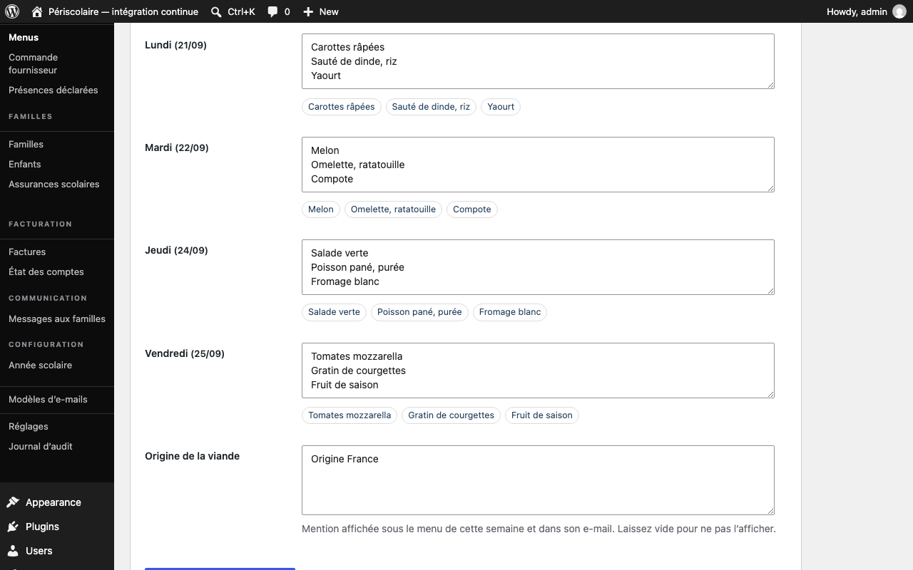

# Menus de cantine

## Objectif

Saisissez le menu de chaque jour ouvert, vérifiez son aperçu, puis envoyez-le aux familles.

## Avant de commencer

Connectez-vous avec un rôle autorisé à gérer la cantine. Préparez les plats de la prochaine semaine ouverte et, si besoin, le texte sur l'origine de la viande.

## Étapes

1. Ouvrez **Périscolaire › Menus** et choisissez la semaine dans **Semaine du**. Les jours de vacances ou de fermeture ne sont pas proposés.
2. Renseignez un plat par ligne dans le champ de chaque jour. Pour afficher un label qualité, ajoutez une étoile `*` après le nom du plat pour le label Bio, ou deux étoiles `**` pour le label Label Rouge. Sans étoile, aucun label n'est affiché.
3. Contrôlez l'aperçu qui se met à jour sous chaque champ : les étoiles disparaissent du texte et le logo correspondant apparaît. Ajoutez l'**Origine de la viande** si cette information doit être communiquée.

   

4. Cliquez sur **Enregistrer le menu** pour une nouvelle semaine, ou sur **Enregistrer les modifications** pour un menu existant. L'enregistrement reste un brouillon : il n'envoie aucun e-mail.
5. Dans **Menus enregistrés**, vérifiez que les jours sont renseignés et que la colonne **Envoi** indique **Non envoyé**. Cliquez sur **Envoyer aux familles**, puis confirmez l'envoi à toutes les familles actives.
6. Pour corriger un menu déjà enregistré, cliquez sur **Modifier**, enregistrez les modifications, puis utilisez **Renvoyer** si un nouvel e-mail doit partir.

## Résultat attendu

Le menu de la semaine est lisible dans le portail famille et l'e-mail, les labels Bio ou Label Rouge sont correctement signalés et l'envoi est daté dans la liste des menus.

## Pour aller plus loin

- [Calendrier et vacances](../configuration/calendrier-vacances.md)
- [Annulations et absences](annulations-absences.md)
- [Tableau de bord](tableau-de-bord.md)
