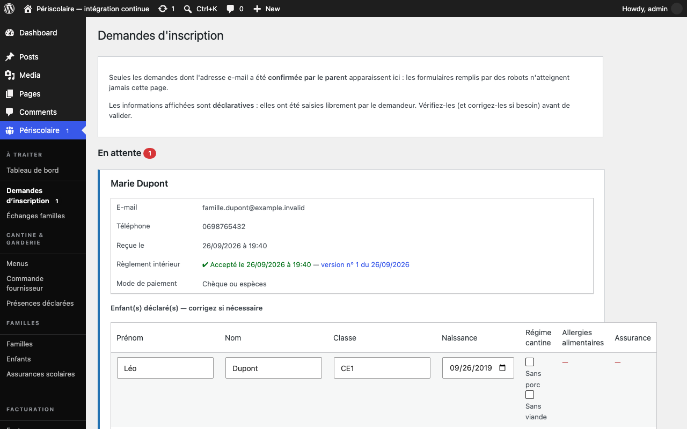

# Modération des inscriptions

## Objectif

Effectuez la [modération](../glossaire.md#moderation) des demandes d'inscription avant d'ouvrir l'accès au portail famille.

## Avant de commencer

Connectez-vous à WordPress avec un rôle autorisé à gérer les demandes. Une demande n'apparaît ici qu'après la confirmation de l'adresse e-mail par le parent.

## Étapes

1. Ouvrez **Périscolaire › Demandes d'inscription** et consultez la section **En attente**. Le parent a déjà rempli le formulaire et confirmé son adresse ; les demandes non vérifiées restent hors de cette file.
2. Examinez l'identité et les coordonnées affichées : e-mail, téléphone, date de réception, message, acceptation du règlement intérieur et mode de paiement. Vérifiez également les enfants déclarés, leur classe, leur date de naissance, leur régime alimentaire, la présence de leur assurance et, le cas échéant, le signalement d'un échange à prévoir sur l'alimentation.

   

3. Corrigez si nécessaire le **Prénom**, le **Nom** ou la **Classe** directement dans le tableau **Enfant(s) déclaré(s) — corrigez si nécessaire**. Le justificatif d'assurance et le signalement alimentaire ne sont pas modifiables dans cette étape : demandez une correction à la famille ou utilisez l'écran prévu après validation.
4. Cliquez sur **Valider et donner l'accès**, puis confirmez. La famille est créée avec ses enfants et reçoit immédiatement son lien d'accès par e-mail.
5. Pour refuser la demande, ouvrez **Refuser cette demande**, renseignez un **Motif (facultatif)**, laissez **Informer le demandeur par e-mail** coché si vous souhaitez prévenir la famille, puis cliquez sur **Refuser la demande**.
6. Si un bandeau **Reporter les allergies sur les fiches** apparaît en haut de l'écran, il concerne des demandes validées avant la mise en place du signalement alimentaire : elles portaient une description d'allergie que la fiche enfant créée ne mentionne pas. Le report complète uniquement les fiches restées vides et déclenche le rappel PAI ; il ne touche jamais une fiche déjà renseignée.
7. Retrouvez les décisions précédentes dans **Demandes traitées**. Les demandes approuvées ou refusées y restent consultables jusqu'à leur purge automatique.
8. Si vous souhaitez supprimer la relecture mairie après confirmation d'e-mail, consultez le réglage d'auto-approbation dans **Périscolaire › Réglages**. Ce mode donne l'accès immédiatement ; vérifiez donc que votre organisation l'autorise avant de l'activer.

## Résultat attendu

Chaque demande confirmée reçoit une décision tracée, les familles validées obtiennent leur accès et les familles refusées reçoivent le motif lorsque vous avez choisi de les informer.

## Pour aller plus loin

- [Tableau de bord](tableau-de-bord.md)
- [Régimes alimentaires](../configuration/regimes-alimentaires.md)
- [Démarrage rapide](../demarrage-rapide.md)
