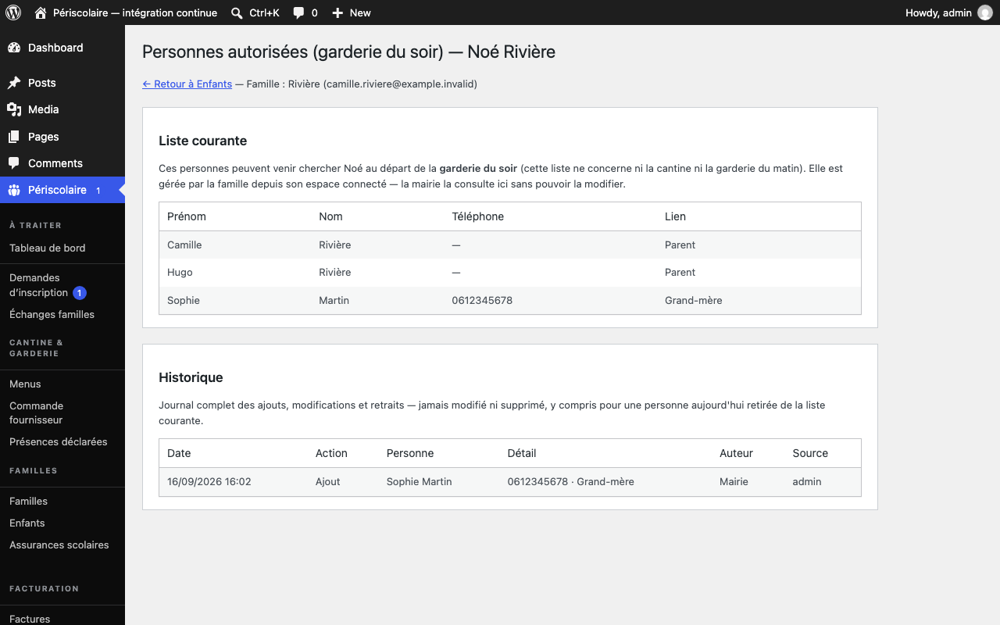

# Personnes autorisées

## Objectif

Gérez la liste des [personnes autorisées](../glossaire.md#personne-autorisee) à venir chercher un enfant à la garderie du soir.

## Avant de commencer

Identifiez l'enfant concerné et vérifiez avec la famille les coordonnées de chaque personne. La famille peut modifier la liste depuis son espace connecté ; la mairie la consulte depuis la fiche de l'enfant.

## Étapes

1. Depuis la fiche de l'enfant, ouvrez l'écran **Personnes autorisées**. Dans le portail famille comme dans la vue mairie, les responsables du foyer apparaissent toujours dans la liste ; ils ne sont pas supprimables comme des tiers.
2. Pour ajouter un tiers, la famille renseigne son prénom, son nom, son téléphone et son **Lien**, puis enregistre. La mairie ne peut pas ajouter ou modifier une personne depuis cet écran : elle demande la correction au foyer.
3. Consultez **Liste courante** pour vérifier les personnes habilitées. Cette liste concerne uniquement le départ de la **garderie du soir**, pas la cantine ni la garderie du matin.

   

4. Lorsqu'une personne ne doit plus être habilitée, la famille la retire depuis son espace. La ligne disparaît de la liste courante mais son retrait reste tracé.
5. Ouvrez **Historique** pour consulter les ajouts, modifications et retraits, avec la date, la personne, le détail, l'auteur et la source (**Famille** ou **Mairie**). Le journal n'est jamais modifié ni supprimé.

## Résultat attendu

La garderie du soir dispose d'une liste à jour pour chaque enfant et la mairie peut vérifier l'historique complet sans modifier silencieusement une habilitation.

## Pour aller plus loin

- [Documents (assurance)](documents-assurance.md)
- [Annulations et absences](annulations-absences.md)
- [Tableau de bord](tableau-de-bord.md)
