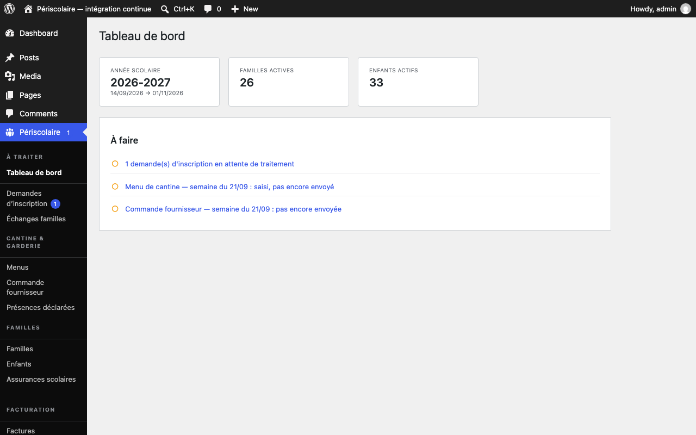

# Tableau de bord

## Objectif

Utilisez le tableau de bord pour vérifier l'état général du service et ouvrir directement les actions qui demandent votre intervention.

## Avant de commencer

Connectez-vous à WordPress en administrateur : le tableau de bord réunit tous les domaines et reste réservé aux administrateurs. Un agent habilité à quelques domaines seulement arrive directement sur son premier écran autorisé, cf. [Accès des agents de la mairie](../installation/acces-agents.md). Les chiffres et les alertes sont calculés à partir des données présentes dans le plugin ; actualisez la page après une opération importante.

## Étapes

1. Ouvrez **Périscolaire › Tableau de bord**. Le bloc des indicateurs affiche **Année scolaire**, **Familles actives** et **Enfants actifs**. Ces informations décrivent la situation courante et ne déclenchent aucune action à elles seules.
2. Consultez le bloc **À faire**. Chaque ligne correspond à une action concrète et son lien ouvre directement l'écran concerné.
3. Traitez les **demande(s) d'inscription en attente de traitement** depuis **Demandes d'inscription**.
4. Vérifiez le **Menu de cantine — semaine du …** dans **Menus** et saisissez-le ou envoyez-le selon son état.
5. Vérifiez la **Commande fournisseur — semaine du …** dans **Commande fournisseur**, puis envoyez-la lorsqu'elle est prête, cf. [Commande fournisseur](commande-fournisseur.md).
6. Si l'année scolaire est absente ou proche de sa fin, ouvrez **Année scolaire** pour définir les dates, vacances et jours fériés ou préparer l'année suivante.

   

## Résultat attendu

Vous distinguez les indicateurs de suivi, qui n'exigent pas d'intervention, des lignes **À faire**, qui vous conduisent vers les tâches à traiter.

## Pour aller plus loin

- [Démarrage rapide](../demarrage-rapide.md) pour la check-list de mise en service
- [Année scolaire](../configuration/annee-scolaire.md)
- [Services et tarifs](../configuration/services-tarifs.md)
