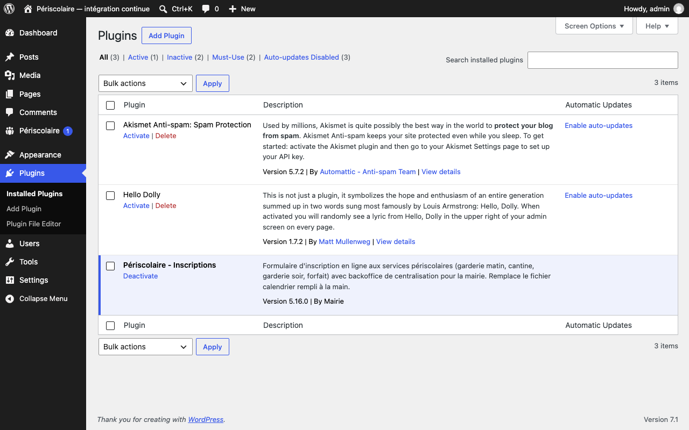

# Installation et activation

## Objectif

Installez le plugin sur WordPress et activez ses tables, capacités et tâches initiales.

## Avant de commencer

Vérifiez les [prérequis](prerequis.md), disposez d'un accès administrateur WordPress et sauvegardez la base avant une première activation sur un site existant.

## Étapes

1. Téléchargez le fichier ZIP de la Release GitHub, ou copiez le dossier du plugin dans `wp-content/plugins/` sur le serveur.
2. Dans WordPress, ouvrez **Extensions**, repérez **Périscolaire — Inscriptions**, puis cliquez sur **Activer**.

   

3. À l'activation, le plugin crée ou met à jour ses tables, accorde les capacités de gestion au seul rôle administrateur, et programme ses tâches automatiques. Consultez [Tâches planifiées](taches-planifiees.md) pour le suivi de ces tâches.
4. Pour donner l'accès à un agent sans lui confier les droits d'administrateur, cochez ses habilitations sur son profil WordPress : voir [Accès des agents de la mairie](acces-agents.md).
5. Ouvrez **Périscolaire** pour vérifier que le menu et le tableau de bord sont accessibles, puis configurez l'année scolaire et les réglages avant l'ouverture aux familles.

## Résultat attendu

L'extension est active, ses tables et capacités sont disponibles, les tâches sont planifiées et le rôle métier choisi peut accéder au backoffice sans privilèges excessifs.

Cela ne dit rien de l'hébergement lui-même : l'inaccessibilité réelle des documents, le comportement du cache, l'exécution du cron et la restauration des sauvegardes se constatent sur le serveur. Déroulez la [fiche de recette de l'hébergement](fiche-recette-p1.md) avant la mise en service.

## Pour aller plus loin

- [Prérequis](prerequis.md)
- [Accès des agents de la mairie](acces-agents.md)
- [Envoi des e-mails (SMTP)](emails-smtp.md)
- [Fiche de recette de l'hébergement](fiche-recette-p1.md)
- [Sauvegarde et mise à jour](sauvegarde-mise-a-jour.md)
