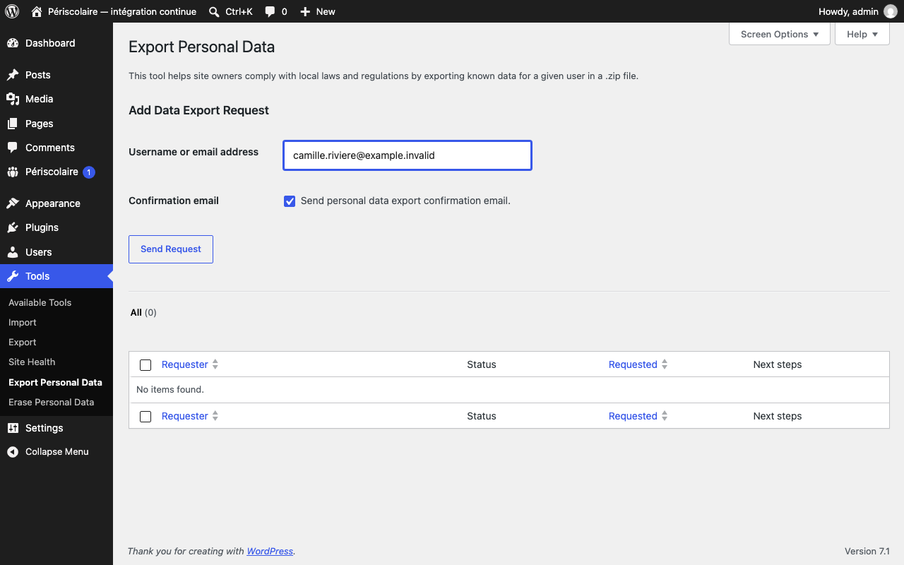

# Données personnelles (RGPD)

## Objectif

Traitez les demandes d'accès et d'effacement des familles avec les outils de confidentialité natifs de WordPress, en respectant les durées de conservation applicables.

## Avant de commencer

Utilisez un compte administrateur WordPress et vérifiez l'adresse e-mail exacte du foyer. Les familles du plugin n'ont pas de compte WordPress : elles sont retrouvées par leur adresse e-mail.

## Notice affichée aux familles

Une courte notice de confidentialité apparaît au formulaire d'inscription et dans **Mes enfants**. Paramétrez-la dans **Périscolaire › Réglages**, rubrique **Confidentialité** :

- **Responsable du traitement** : le nom de la collectivité. Tant qu'il est vide, les familles lisent « Collectivité (à adapter) » et une alerte le rappelle dans le back office.
- **E-mail du DPO** et **E-mail pour exercer ses droits** : l'adresse affichée aux familles pour exercer leurs droits.
- **Adresse de la notice complète** : ajoute le lien « Lire la notice de confidentialité ».

L'**Aperçu** montre la notice exactement telle que les familles la voient, avec les valeurs enregistrées. Faites valider son contenu par le DPO.

## Étapes

1. Ouvrez **Outils › Exporter les données personnelles**, saisissez l'adresse e-mail du responsable, puis lancez la demande. Le plugin ajoute ses données à l'export natif.
2. Contrôlez l'archive produite : elle contient le profil du foyer, les enfants, la scolarité par année, le planning, les personnes autorisées, les factures envoyées et les échanges avec la mairie. Les données sensibles sont protégées dans l'export technique : l'IBAN est partiellement masqué, la présence d'une allergie est signalée sans son détail et le contenu des conversations n'est pas recopié.

   

3. Pour une demande d'effacement, ouvrez **Outils › Effacer les données personnelles**, saisissez la même adresse e-mail et confirmez l'opération.

   !!! warning
       L'effacement est irréversible. L'outil WordPress anonymise le foyer et supprime ses coordonnées et données opérationnelles. Les factures sont conservées lorsqu'une obligation comptable s'applique et gardent une référence technique vers une ligne anonymisée. La suppression manuelle depuis **Périscolaire › Familles** suit exactement la même règle : elle ne détruit aucune facture, et anonymise la fiche au lieu de la supprimer tant qu'il en reste une.

4. Informez la famille du périmètre réellement effacé. Précisez que les factures déjà émises sont conservées, et qu'elles portent toujours l'identité sous laquelle elles ont été établies : une pièce comptable ne se réécrit pas, sans quoi elle perdrait la valeur probante qui justifie précisément sa conservation. Cette identité disparaît avec la facture, au terme de la durée de conservation retenue. Si nécessaire, relisez le texte suggéré par le plugin dans la page WordPress **Réglages › Confidentialité** avant de le publier ; il n'est jamais publié automatiquement. (Ne pas confondre avec la rubrique **Confidentialité** de **Périscolaire › Réglages**, qui paramètre la notice courte, cf. ci-dessus.)
5. Laissez la purge automatique traiter les enfants partis : chaque jour, la fiche d'un enfant qui n'est inscrit ni à l'année active ni à l'année en préparation est purgée sans action humaine, 400 jours après la plus récente de ces deux dates : sa sortie en cours d'année (**Marquer sorti**), ou la fin de la dernière année où il était inscrit. Un enfant non réinscrit est donc traité comme un enfant sorti en fin d'année. Cette purge ne supprime pas le foyer ni les factures conservées.

6. Avant d'activer une nouvelle durée, faites exécuter le rapport de rétention en mode **simulation** par l'administrateur (WP-CLI ou outil d'administration qui l'exposera). Les catégories non validées par la mairie/DPO restent bloquées et le rapport indique les volumes examinés, conservés et les erreurs éventuelles. La validation des durées, du circuit PAI, de l'AIPD et des archives reste manuelle.

## Qui voit quoi

Dans le backoffice, chaque agent n'accède qu'aux domaines cochés sur son profil. Les allergies ne s'affichent qu'aux personnes habilitées aux **Données de santé**. Le rôle Éditeur de WordPress n'a aucun accès aux dossiers. Voir [Accès des agents de la mairie](installation/acces-agents.md).

Côté familles, chaque foyer ne voit et ne modifie que ses propres données. Des tests automatiques le vérifient à chaque version : une famille qui tente d'atteindre les enfants, documents ou factures d'une autre est refusée.

## Ce que le plugin ne décide pas

Les points suivants ne sont tenus par aucun réglage ni aucun test : ils demandent une décision ou un constat, et restent ouverts tant que personne ne les a tranchés et datés.

| Sujet | Qui décide |
| --- | --- |
| Base légale des traitements, et durées de conservation par catégorie | DPO, avec le service d'archives pour le sort final |
| Nécessité d'une analyse d'impact (AIPD), et sa réalisation le cas échéant | DPO |
| Registre des traitements, contrats de sous-traitance, procédure de violation de données | Mairie et DPO |
| Qualification des descriptions d'allergie collectées avant le signalement minimal | DPO |
| Relecture de la notice de confidentialité, coordonnées réelles, information des tiers | DPO |
| Procédure de vérification d'identité du demandeur et délai de réponse | Mairie |
| Liste des agents habilités, en particulier aux données de santé, et sa revue périodique | Mairie |
| Circuit PAI et responsabilités lors de l'échange oral sur l'alimentation | Mairie |
| Qualification comptable des factures PDF et procédure de correction | Service facturation |
| Inaccessibilité réelle des documents, cache, sauvegardes et restauration | Hébergeur, via la [fiche de recette](installation/fiche-recette-p1.md) |

Un relevé des garanties techniques réellement en place peut être produit à tout moment par la personne qui maintient l'instance : il distingue ce qu'un test vérifie de ce qui relève de cette liste.

## Résultat attendu

La demande est traitée par l'outil WordPress, l'export restitue les métadonnées autorisées sans secrets en clair, et l'effacement respecte la règle de conservation des factures configurée par la mairie. La base légale, les durées définitives et la recette de l'hébergement ne sont pas déterminées par le plugin.

## Pour aller plus loin

- [Démarrage rapide](demarrage-rapide.md)
- [Documents (assurance)](gestion-quotidienne/documents-assurance.md)
- [Sauvegarde et mise à jour](installation/sauvegarde-mise-a-jour.md)
